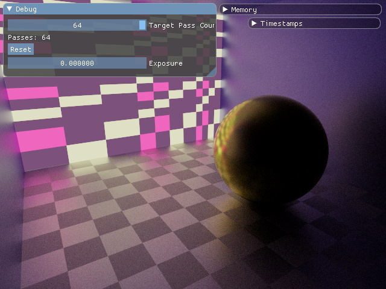
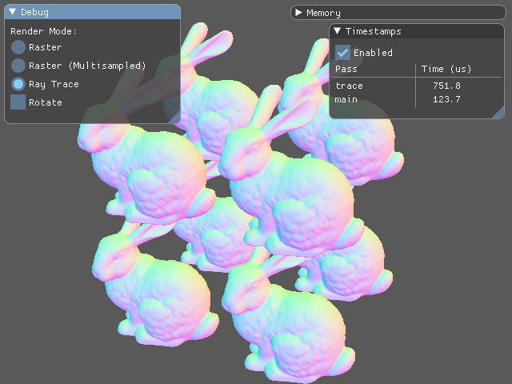
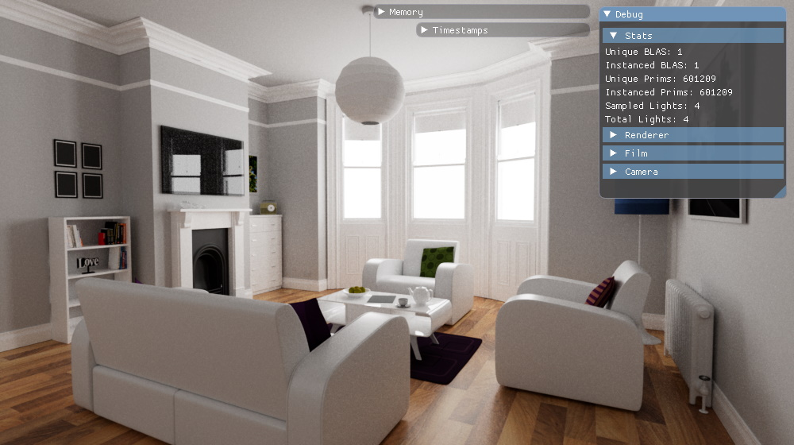

# caldera

## Library Overview

Vulkan and rust experiments. The code is split into a core `caldera` crate and a few different _apps_. Everything is work in progress, but this repository is public in case the code is interesting for others.

The `caldera` crate covers the following:

* Makes use of [spark](https://github.com/sjb3d/spark) to manage Vulkan commands and extensions
* A procedural macro for descriptor set layouts
* Render graph implementation, working (but inoptimal) support for:
  * Automatic memory allocation of temporary buffers and images
  * Automatic placement of barriers and layout transitions
* Various helpers to cache Vulkan objects, with live reload of shaders
  * Live reload not yet supported for ray tracing pipeline shaders (shader binding table not updated yet)
* Asynchronous loading of static buffers and images from the CPU

There are a few apps that make use of this crate for higher-level experiments, detailed below.

## Apps Overview

Shaders are currently built using make and [glslangValidator](https://github.com/KhronosGroup/glslang) (using [make for windows](http://gnuwin32.sourceforge.net/packages/make.htm) and the [LunarG Vulkan SDK](https://vulkan.lunarg.com/) on Windows).

Apps can be run using:

```
make && cargo run --bin <app_name>
```

Command-line support (via [`structopt`](https://crates.io/crates/structopt/) has recently been added, so apps now show their supported arguments by running:

```
make && cargo run --bin <app_name> -- --help
```

### `compute`



A simple path tracer in a compute shader, also for tinkering with:

* [Progressive Multi-Jittered Sample Sequences](https://graphics.pixar.com/library/ProgressiveMultiJitteredSampling/) implemented in [pmj](https://github.com/sjb3d/pmj)
  * Several sequences are generated at startup, then indexed by hashing the pixel coordinate and ray depth
* Wide colour gamut in the [ACEScg](https://en.wikipedia.org/wiki/Academy_Color_Encoding_System) colour space, transformed to sRGB/Rec709 using the approach in [BakingLab](https://github.com/TheRealMJP/BakingLab/blob/master/BakingLab/ACES.hlsl)
  * There is code to re-derive the colour space conversion matrices in [`color_space.rs`](https://github.com/sjb3d/caldera/blob/main/caldera/src/color_space.rs), but the tonemap curve fit is used as-is
* Used as an initial test for the render graph and descriptor set helpers

### `mesh`



Initial test project for `VK_KHR_acceleration_structure` and `VK_KHR_ray_tracing_pipeline`.  Takes a PLY mesh filename as argument ([Stanford bunny](http://graphics.stanford.edu/data/3Dscanrep/) shown above), draws a few instances using either rasterisation or ray tracing.

Has code for:
* Loading a PLY mesh using [ply-rs](https://github.com/Fluci/ply-rs)
* Basic rasterisation with instancing and MSAA support
  * Trying out Vulkan _transient attachments_ for depth (and colour when using MSAA)
* Acceleration structure creation
  * A single bottom level acceleration structure for the PLY mesh
  * A top level acceleration structure that instances it a few times
* Simple ray tracing pipeline
  * Just interpolates vertex normals on hit

### `trace`



A path tracer built on Vulkan ray tracing.  **[For more information about this path tracer and a gallery click here.](docs/path_tracer.md).**  The scene above is from these [rendering resources](https://benedikt-bitterli.me/resources/) made available by Benedikt Bitterli.

## Library Details

### Procedural Macro for Descriptor Set Layout

The macro `descriptor_set_layout!` is implemented in `caldera-macro`. This allows the layout to be declared using struct-like syntax.  For example, consider the following bindings in GLSL:

```glsl
layout(set = 0, binding = 0, scalar) uniform CopyData {
    vec2 params;
    float more;
} g_copy;

layout(set = 0, binding = 1, r32f) uniform restrict image2D g_images[3];
```

The descriptor set layout for set 0 above can be generated using the macro (and the [bytemuck](https://crates.io/crates/bytemuck) crate) as follows:

```rust
// uses bytemuck::Pod to safely alias as bytes
#[repr(C)]
#[derive(Clone, Copy, Zeroable, Pod)]
struct CopyData {
    params: Vec2, // [f32; 2] layout
    more: f32,
}

descriptor_set_layout!(CopyDescriptorSetLayout {
    copy: UniformData<CopyData>,
    images: [StorageImage; 3],
});
```

This generates a `CopyDescriptorSetLayout` struct with two methods:

* A `new()` method that creates the corresponding Vulkan descriptor set layout, intended to be called once at startup.
* A `write()` method that fully writes a descriptor set with uniform data and buffer/image views, intended to be called each time the descriptor set needs (fully) writing each frame.

This helps to cut down on boilerplate code for descriptor sets that can be declared at build time.

### Render Graph Details

The render graph has two goals:

* Automatic memory allocation of _temporary_ resources needed throughout the frame
* Automatic placement of barriers and layout transitions between _groups_ of draws/dispatches/other

_TODO: figure out what bits are worth documenting_

* Build a schedule by registering callbacks for _graphics_ or _compute_ work
  * _Graphics_ work is a collection of draw calls to the same render pass (TODO: consider sub-pass?)
  * _Compute_ work is a collection of dispatches/transfers/ray traces/etc
* Synchronisation happens _between_ these collections only
  * Each work item must declare usage for _all_ the images/buffers used by its draws and dispatches
  * All the draws or dispatches within a single work item should be considered as occuring in parallel on the GPU, there is no additional synchronisation _within_ a work item
* Can _declare_ temporary buffers or images while building a schedule
  * Usage is gathered as the schedule is built
  * Memory will be allocated while running the schedule, Vulkan objects are passed to the callback
* Can _import_ static buffers or images that need synchronisation
  * A swapchain image for example
