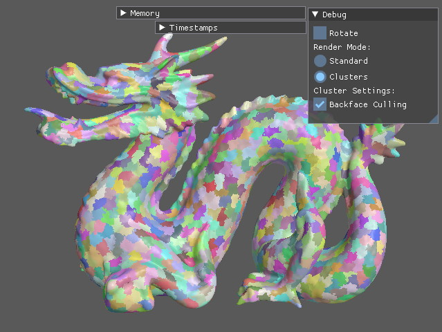

# caldera

Vulkan and rust experiments. The code is split into a core `caldera` crate and a few different examples. Everything is work in progress and unstable, but this repository is public in case the code is interesting for others.

## Features

- Render graph implementation over Vulkan, featuring:
  - Automatic memory allocation of temporary buffers and images
  - Automatic placement of barriers and layout transitions
- Makes use of [spark](https://github.com/sjb3d/spark) to manage Vulkan commands and extensions
- Live reload of shaders (not ray tracing pipeline shaders yet though)
- A [procedural macro](caldera-macro) for descriptor set layouts
- Asynchronous loading support for static buffers and images

## Examples

Examples can be run as follows:

```
make && cargo run --example <example_name> -- --help
```

The call to `make` is required to build shaders, which depends on [glslangValidator](https://github.com/KhronosGroup/glslang).
On windows, [make for windows](http://gnuwin32.sourceforge.net/packages/make.htm) and the [LunarG Vulkan SDK](https://vulkan.lunarg.com/) can provide these.
Omit `--help` and add other command-line arguments as necessary for each sample.

In the table below, please follow the link in the name or image of each example for more information.

Screenshot | Description
--- | ---
[](caldera/examples/test_compute) | [**test_compute**](caldera/examples/test_compute)<br/>Initial test for synchronisation between compute and graphics.  Implements a toy path tracer in a single compute shader, reads the result during rasterization of the UI.
[](caldera/examples/test_ray_tracing) | [**test_ray_tracing**](caldera/examples/test_ray_tracing)<br/>Test of the `VK_KHR_acceleration_structure` and `VK_KHR_ray_tracing_pipeline` extensions. Loads a PLY format mesh and draws a few instances using either rasterization or ray tracing.
[](caldera/examples/test_mesh_shader) | [**test_mesh_shader**](caldera/examples/test_mesh_shader)<br/>Test of the `NV_mesh_shader` extension.  Loads a PLY format mesh, makes some clusters, then draws the result using either the standard vertex pipeline or mesh shaders. Cluster-level backface culling is implemented efficiently in the task shader using subgroup operations from the `GL_KHR_shader_subgroup_ballot` GLSL extension.
[](caldera/examples/path_tracer) | [**path_tracer**](caldera/examples/path_tracer)<br/>A path tracer built on Vulkan ray tracing with support for spectral rendering and several different surfaces and light types. The [README](caldera/examples/path_tracer) for this example contains many more details. The scenes shown here are from these [rendering resources](https://benedikt-bitterli.me/resources/) made available by Benedikt Bitterli.

## Potential Future Work

- [ ] Buffer views?
- [ ] Use futures for async loading
- [ ] Occlusion culling in mesh shader example
