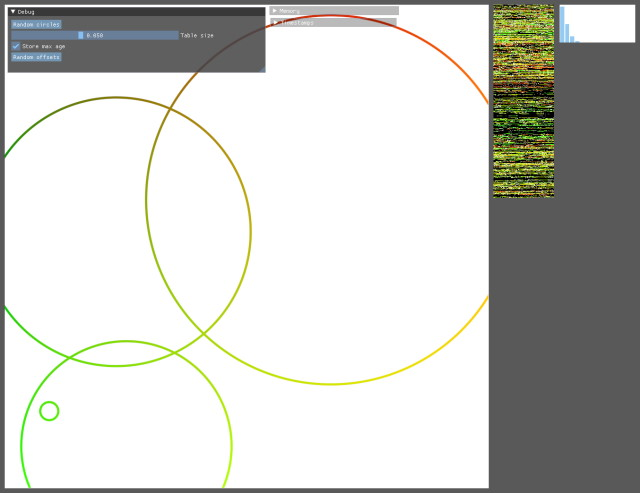

# coherent_hashing

This is an implementation of [Coherent Parallel Hashing](http://ggg.udg.edu/publicacions/UsersWebs/cohash_siga2011/index.shtml), which is a useful GPU data structure for hash tables when the keys are coherent.

Run using:

```
make && cargo run --release --example coherent_hashing
```

When run, the following output should be shown:



The window contents from left to right are:

- A 1024x1024 input image with sparse contents. A hash table is built from the non-empty pixels.
  - To generate coherent keys, the [morton code](https://en.wikipedia.org/wiki/Z-order_curve) of the image coordinate is used as the key
- A visual representation of the 1D hash table in scanline order. Empty entries are black, non-empty entries match the colour in the input image.
- A histogram of the _age_ of all the non-empty hash table entries, from 1 to 15. For quick insertion and lookup we want the ages to be as small as possible.

The debug UI can be interacted with to experiment with the following:

- Click the **random circles** button to generate the input image with a different pattern
- Move the **table size** slider to change the maximum size of the hash table. If the hash table is too small to hold all pixels, some pixels will be shown in magenta in the view of the image.
- Toggle **store max age** to check the performance impact this has when reading the hash table.
- Click the **random offsets** button to pick different random offsets to use when offsetting entries by age.
  - Each offset is chosen by picking a large random number, then choosing the first prime number that occurs after it.
