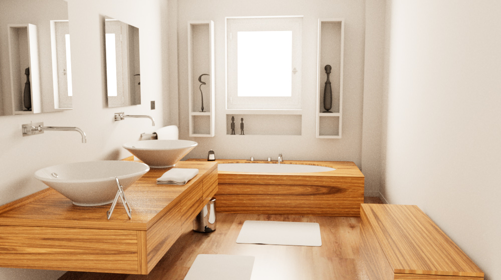
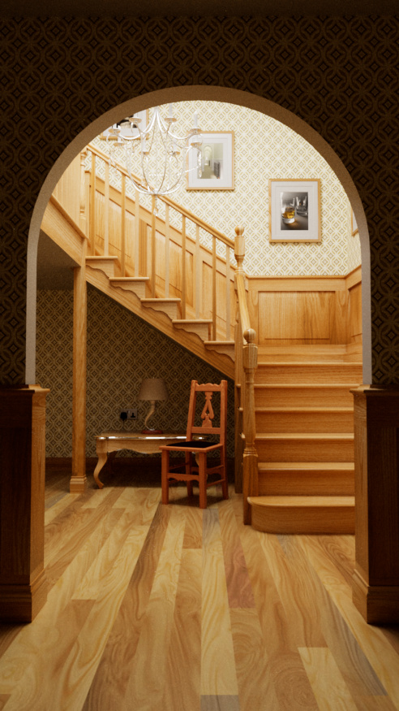
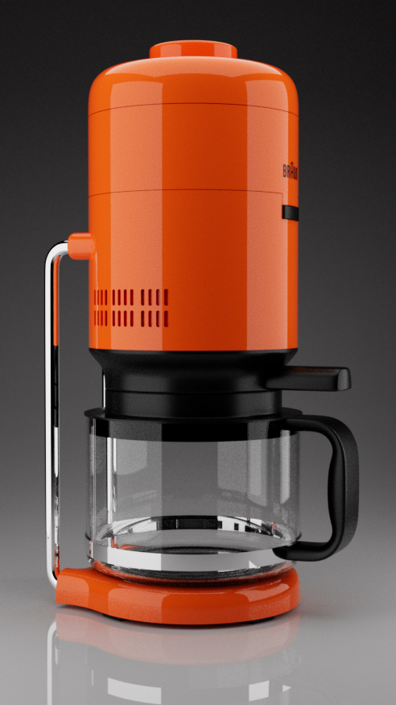
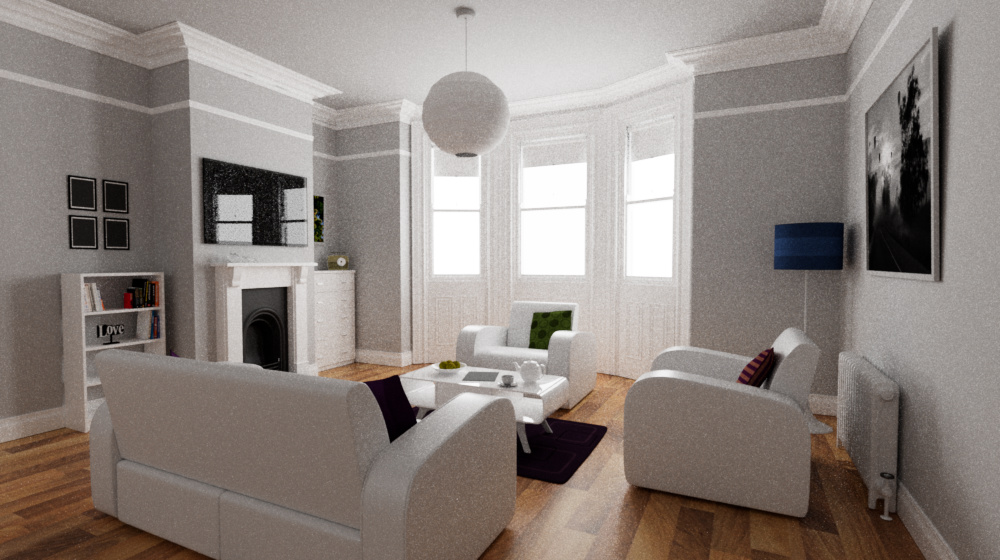
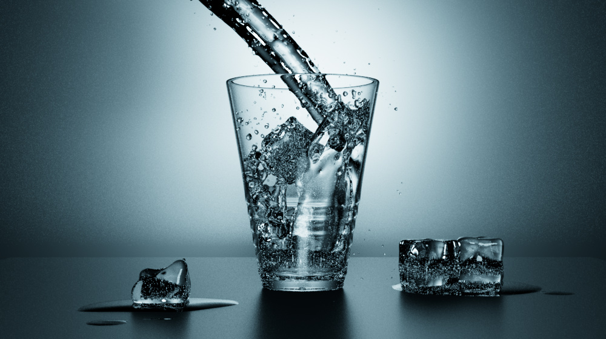

# Caldera Path Tracer

This page has more information about the `trace` app that is part of the [caldera](https://github.com/sjb3d/caldera) project of Vulkan and rust experiments.

The `trace` app is a path tracer that makes use of Vulkan ray tracing extensions.

## Features

* A uni-directional path tracer
  * Implemented as a single Vulkan ray tracing pipeline
  * Support for instanced geometry (via instanced bottom-level acceleration structures)
* Random numbers via [Progressive Multi-Jittered Sample Sequences](https://graphics.pixar.com/library/ProgressiveMultiJitteredSampling/) implemented in [pmj](https://github.com/sjb3d/pmj)
* BSDF importance sampling
  * Diffuse and mirror "ideal" surfaces
  * Fresnel dieletrics and conductors
  * Diffuse with dielectric coating
* Importance sampling of lights
  * Fixed CDF based on light power
  * Quad or sphere shaped emitters
  * Dome or solid angle distant lights
* Fixed material model
  * Reflectance from per-instance constant and/or texture
  * Roughness from per-intance constant
  * Fixed IOR and conductor parameters
* Multiple importance sampling between BSDFs and lights
* Wide gamut rendering and fitted ACES tonemapping using the approach in [BakingLab](https://github.com/TheRealMJP/BakingLab/blob/master/BakingLab/ACES.hlsl)
* Interactive renderer with moveable camera and debug UI

## Gallery

All images below have accumulated 256spp before being directly saved to an image (jpg encoding is currently the only supported method of denoising!).

TODO blender scene

TODO cornell box scene

The next set of images are rendered from these excellent [rendering resources](https://benedikt-bitterli.me/resources/) by Benedikt Bitterli and various artists at [blendswap.com](https://blendswap.com/).

 

## Potential Future Work

- [ ] Denoiser?
- [ ] Rough dielectrics
- [ ] Smooth conductors
- [ ] Generic clearcoat?
- [ ] IOR parameters for dielectrics and conductors
- [ ] Interior media
- [ ] Sobol sampler
- [ ] Thin lens camera
- [ ] Volumetrics
- [ ] Image-based dome light
- [ ] More flexible materials
- [ ] Disc primitive
