# Caldera Path Tracer

This page has more information about the `trace` app that is part of the [caldera](https://github.com/sjb3d/caldera) project of Vulkan and rust experiments.

The `trace` app is a spectral path tracer that makes use of Vulkan ray tracing extensions.

## Features

* A uni-directional spectral path tracer
  * Currently samples 3 wavelengths per ray
  * Implemented as a single Vulkan ray tracing pipeline
  * Support for instanced geometry (via instanced bottom-level acceleration structures)
* Sampling using either pmj02 or sobol sequences (see links below)
* BSDF importance sampling
  * Diffuse and mirror "ideal" surfaces
  * Smooth or rough fresnel dieletrics and conductors
  * Diffuse with dielectric coating
* Importance sampling of lights
  * Quad/disc/sphere or triangle mesh shaped emitters
  * Dome or solid angle distant lights
* Multiple importance sampling between BSDFs and lights
* Simple fixed material model
  * Reflectance from per-instance constant and/or texture
  * All other parameters are either per-instance or global constants (for now)
* Interactive renderer with moveable camera and debug UI

## Links

Here are some of the references used when creating the renderer:

* [Hero Wavelength Spectral Sampling](https://cgg.mff.cuni.cz/~wilkie/Website/EGSR_14_files/WNDWH14HWSS.pdf) to associate more than one wavelength with each ray (where possible) for reduced colour noise
* [Continuous Multiple Importance Sampling](http://iliyan.com/publications/ContinuousMIS) to sample all wavelengths of the ray proportional to the illuminant, to reduce colour noise even more
* [CIE 1931 Colour Matching Functions](http://cvrl.ioo.ucl.ac.uk/) to convert spectral samples to the XYZ colour space
* [An RGB to Spectrum Conversion for Reflectances](http://citeseerx.ist.psu.edu/viewdoc/download?doi=10.1.1.40.9608&rep=rep1&type=pdf) to use Rec709/sRGB colours as reflectance in a spectral renderer
* [RefractiveIndex.info](https://refractiveindex.info/) for measured material properties for dielectrics and conductors
* [Chromatic Adaptation](http://www.brucelindbloom.com/index.html?Eqn_RGB_XYZ_Matrix.html) description by Bruce Lindbloom to adjust the white point of XYZ samples
* [Filmic Tonemap Operators](http://filmicworlds.com/blog/filmic-tonemapping-operators/) for a Rec709/sRGB tonemap by Hejl and Burgess-Dawson
* [BakingLab](https://github.com/TheRealMJP/BakingLab/blob/master/BakingLab/ACES.hlsl) for a fit of the [ACES](https://github.com/ampas/aces-dev) tonemap
* [Progressive Multi-Jittered Sample Sequences](https://graphics.pixar.com/library/ProgressiveMultiJitteredSampling/) for random sequences, implemented in the [pmj](https://github.com/sjb3d/pmj) crate
* [Practical Hash-based Owen Scrambling](http://www.jcgt.org/published/0009/04/01/) to shuffle/scramble sequences that use the [Sobol direction numbers by Joe/Kuo](https://web.maths.unsw.edu.au/~fkuo/sobol/)
* [Survey of Efficient Representations for Independent Unit Vectors](http://jcgt.org/published/0003/02/01/) covers many options for efficient encoding of unit vectors, the renderer uses octohedral encoding in 32 bits
* [Sampling the GGX Distribution of Visible Normals](http://jcgt.org/published/0007/04/01/) to sample rough surfaces (all rough surfaces in the renderer have GGX-distributed microfacets)
* [Memo On Fresnel Equations](https://seblagarde.wordpress.com/2013/04/29/memo-on-fresnel-equations/) for the equations of fresnel dielectrics and conductors
* [Misunderstanding Layering](http://c0de517e.blogspot.com/2019/08/misunderstanding-multilayering-diffuse.html) approximation for energy conservation in layered diffuse and specular materials
* The [Physically Based Rendering From Theory To Implementation](https://www.pbrt.org/) (PBRT) book, I have the second edition but the 3rd edition is available for free [online](http://www.pbr-book.org/)!

The following crates have been super useful in making the app:

* [ultraviolet](https://crates.io/crates/ultraviolet): maths library with nice API, used for vectors and transforms
* [bytemuck](https://crates.io/crates/bytemuck): safely alias data as bytes, used for copying to GPU buffers
* [imgui](https://crates.io/crates/imgui)/[imgui-winit-support](https://crates.io/crates/imgui-winit-support): rust API for the fantastic [Dear ImGui](https://github.com/ocornut/imgui), for debug UI
* [serde](https://crates.io/crates/serde)/[serde_json](https://crates.io/crates/serde_json): amazing lib to generate serialisation for rust data structures, used to load Tungsten format JSON scenes
* [stb](https://crates.io/crates/stb): rust API for the [stb libraries](https://github.com/nothings/stb), used for image IO and BC compression
* [winit](https://crates.io/crates/winit): cross platform windowing and events

## Test Images

As is tradition, here are some boxes under a couple of different lighting conditions (original [Cornell box](https://www.graphics.cornell.edu/online/box/data.html) data, and a variant with a mirror material and distant lights).

 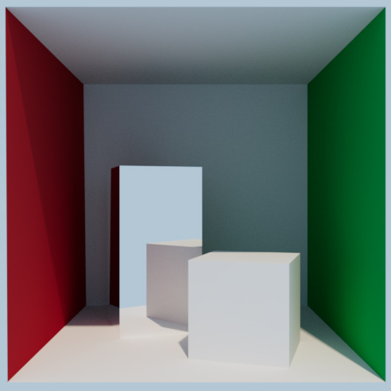

Here is a variation on the classic Veach multiple importance sampling scene, showing 64 samples per pixel with BSDF sampling only, 64 with light sampling only, then 32 samples of each weighted using multiple importance sampling.

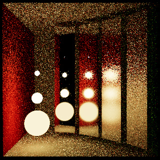 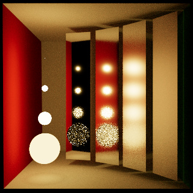
 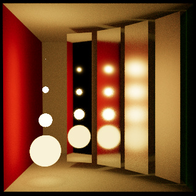

Here is a test scene for some conductors using spectral reflectance data from [refractiveindex.info](https://refractiveindex.info/) for copper, iron and gold under a uniform illuminant (the colours are entirely from the reflectance data, there is no additional tinting).

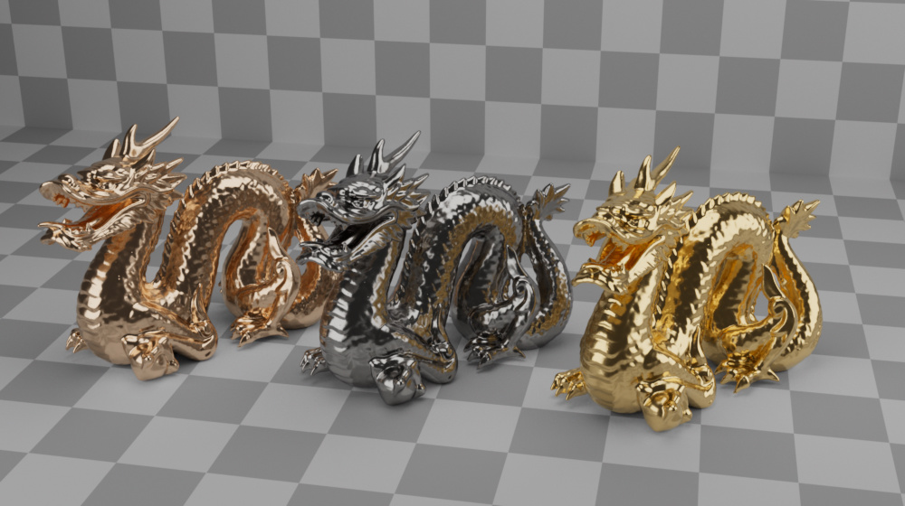

If we change the illuminant to F10 (which has a very spiky distribution), we can check the effect that wavelength importance sampling has on colour noise. The following images use gold lit with F10, all with 8 paths per pixel and 3 wavelengths per path. The first image samples wavelengths uniformly, the second samples only the hero wavelength for that path proportional to F10, the third image samples all wavelengths for that path proportional to F10 (reproducing part of the result of Continuous Importance Sampling):

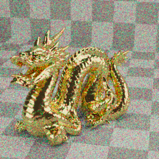  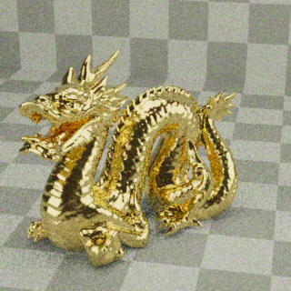

## Gallery

The next set of images are rendered from these excellent [rendering resources](https://benedikt-bitterli.me/resources/) by Benedikt Bitterli and [blendswap.com](https://blendswap.com/) artists nacimus, Wig42, cekuhnen, Jay-Artist, thecali, NewSee2l035 and aXel.

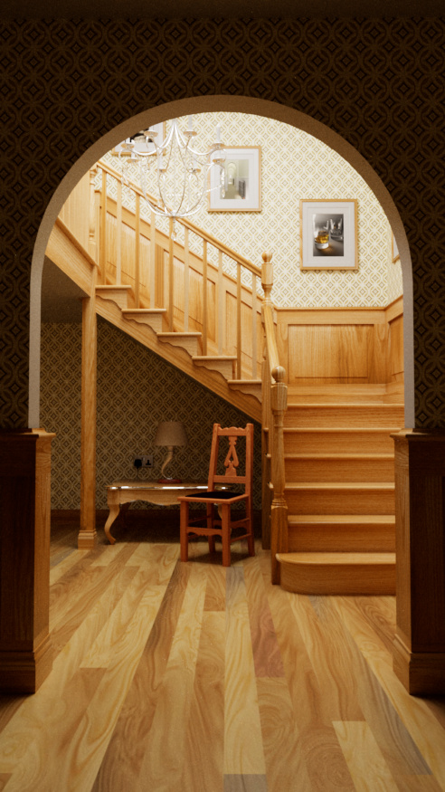 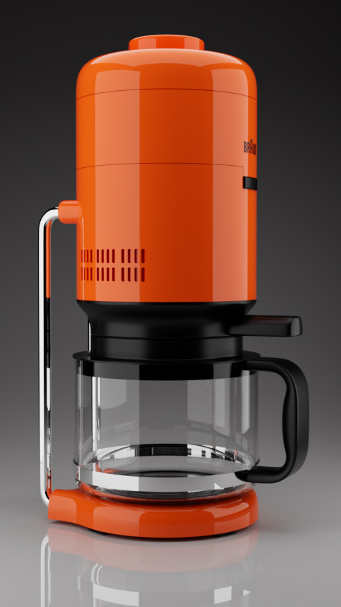

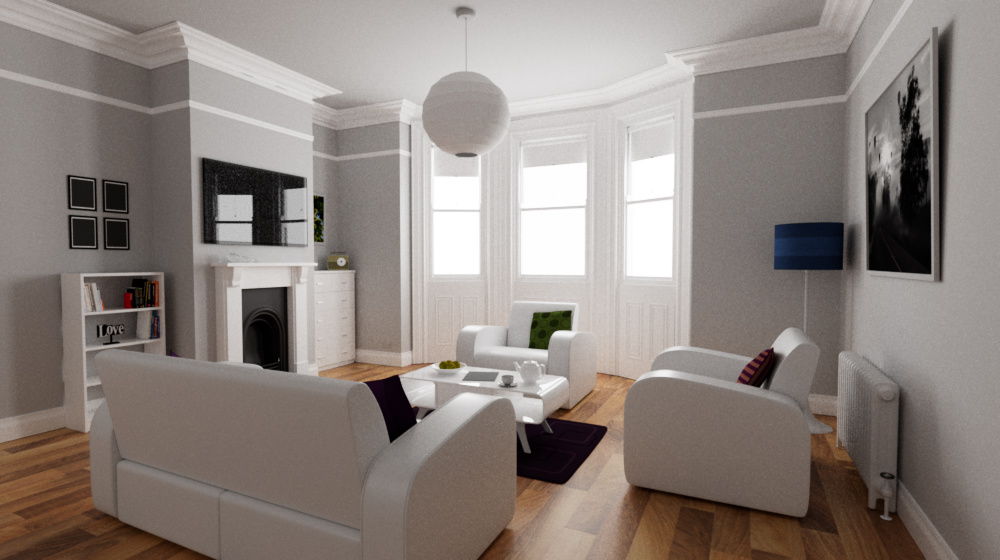

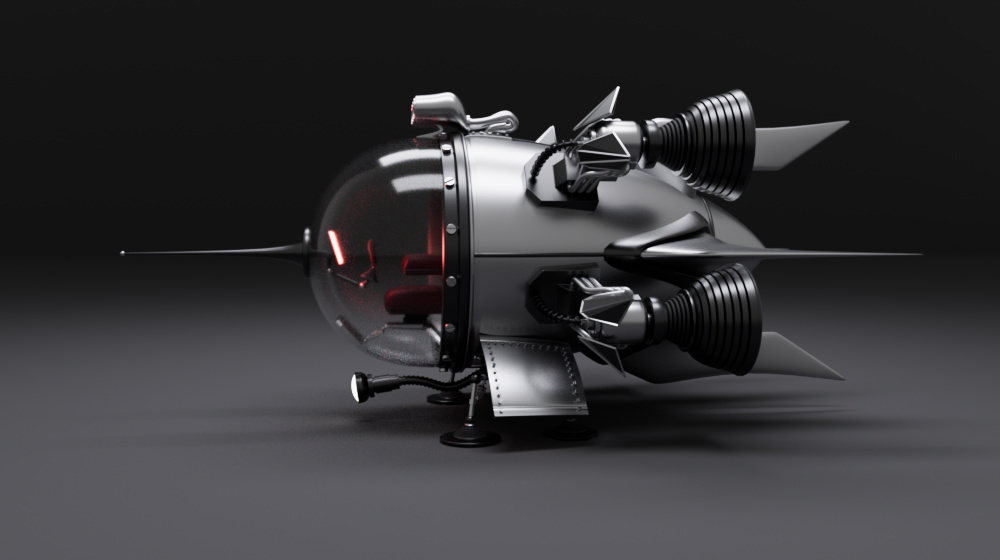

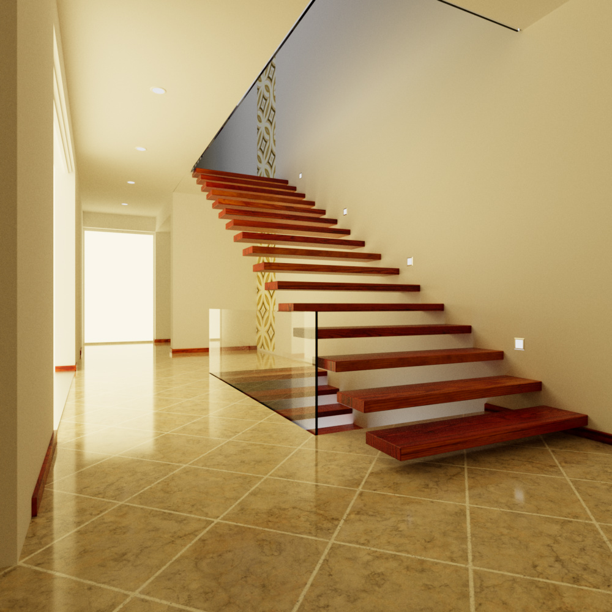

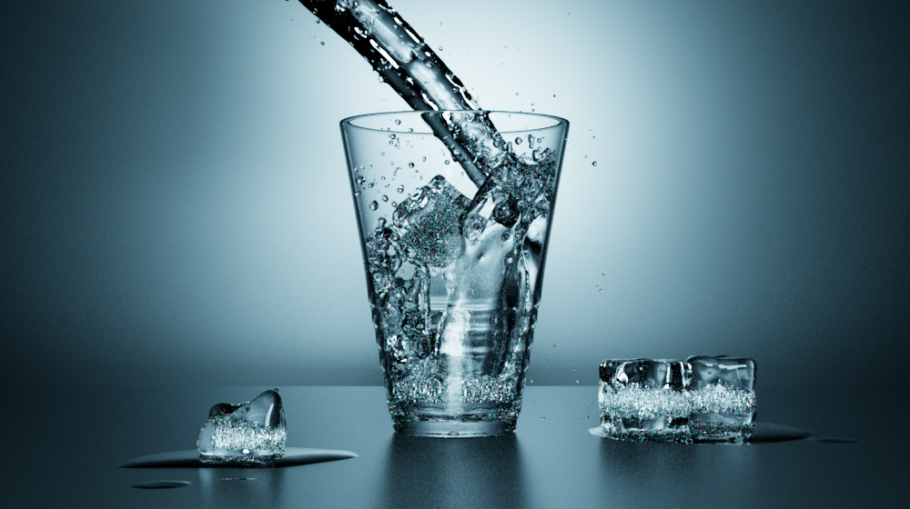

There is a barely started exporter for Blender, but support for materials beyond a simple texture map is a bit out of scope for now.  This image uses the "Classroom" [Blender demo file](https://www.blender.org/download/demo-files/), with highly approximated materials and only sunlight:

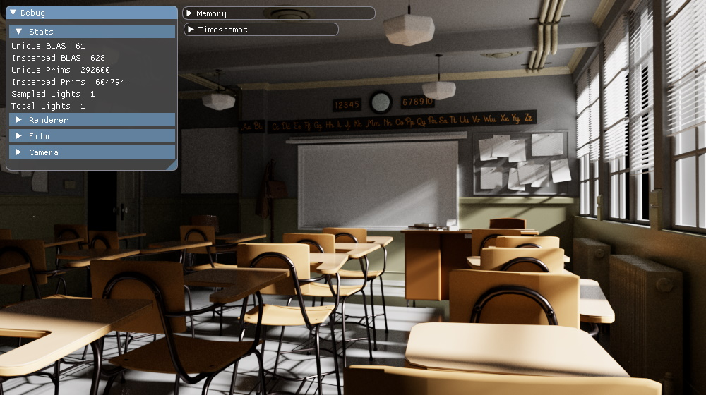

## Potential Future Work

- [ ] Denoiser?
- [ ] Adaptive sampling
- [ ] HDR display output
- [x] Rough dielectrics
- [ ] Smooth conductors
- [ ] Generic clearcoat?
- [x] IOR parameters for conductors
- [ ] IOR parameters for dielectrics
- [ ] Interior media
- [x] Sobol sampler
- [x] Thin lens camera
- [ ] Volumetrics
- [ ] Image-based dome light
- [ ] More flexible materials (graphs?)
- [x] Disc primitive
- [x] Triangle mesh emitter?
- [ ] Microfacet multi-scattering?
- [ ] Path re-use?
- [x] Spectral rendering?
- [x] Spiky illuminants (F10)
