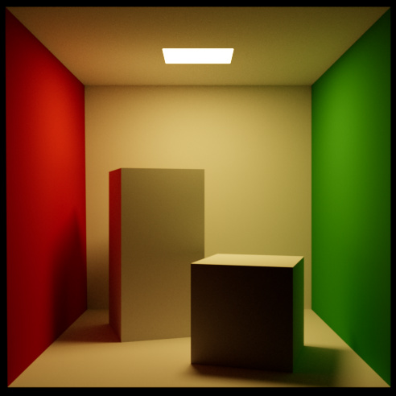
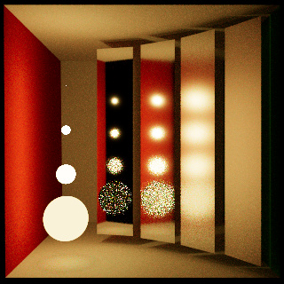

# Caldera Path Tracer

This page has more information about the `trace` app that is part of the [caldera](https://github.com/sjb3d/caldera) project of Vulkan and rust experiments.

The `trace` app is a path tracer that makes use of Vulkan ray tracing extensions.

## Features

* A uni-directional path tracer
  * Implemented as a single Vulkan ray tracing pipeline
  * Support for instanced geometry (via instanced bottom-level acceleration structures)
* Random numbers using [Progressive Multi-Jittered Sample Sequences](https://graphics.pixar.com/library/ProgressiveMultiJitteredSampling/) implemented in [pmj](https://github.com/sjb3d/pmj)
* BSDF importance sampling
  * Diffuse and mirror "ideal" surfaces
  * Fresnel dieletrics and conductors
  * Diffuse with dielectric coating
* Importance sampling of lights
  * Fixed CDF based on light power
  * Quad or sphere shaped emitters
  * Dome or solid angle distant lights
* Fixed material model
  * Reflectance from per-instance constant and/or texture
  * All other parameters are either per-instance or global constants (for now)
* Multiple importance sampling between BSDFs and lights
* Wide gamut rendering and fitted ACES tonemapping using the approach in [BakingLab](https://github.com/TheRealMJP/BakingLab/blob/master/BakingLab/ACES.hlsl)
* Interactive renderer with moveable camera and debug UI

## Gallery

As is tradition, here are some boxes under a couple of different lighting conditions (original [Cornell box](https://www.graphics.cornell.edu/online/box/data.html) data, and a variant with a mirror material and distant lights).

 

Here is a variation on the classic Veach multiple importance sampling scene, showing 64 samples per pixel with BSDF sampling only, light sampling only, then the same samples weighted using multiple importance sampling.

 
 

The next set of images are rendered from these excellent [rendering resources](https://benedikt-bitterli.me/resources/) by Benedikt Bitterli and various artists at [blendswap.com](https://blendswap.com/).

 

There is a barely started exporter for Blender, but support for materials beyond a simple texture map is a bit out of scope for now.  This image uses the "Classroom" [Blender demo file](https://www.blender.org/download/demo-files/), with highly approximated materials and only sunlight:

## Potential Future Work

- [ ] Denoiser?
- [ ] Adaptive sampling
- [ ] HDR display output
- [ ] Rough dielectrics
- [ ] Smooth conductors
- [ ] Generic clearcoat?
- [ ] IOR parameters for dielectrics and conductors
- [ ] Interior media
- [ ] Sobol sampler
- [ ] Thin lens camera
- [ ] Volumetrics
- [ ] Image-based dome light
- [ ] More flexible materials (graphs?)
- [ ] Disc primitive
- [ ] Triangle mesh emitter?
- [ ] Microfacet multi-scattering?
- [ ] Path re-use?
