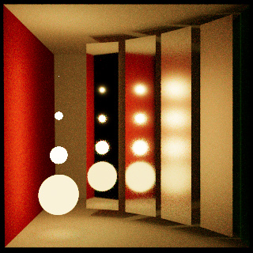
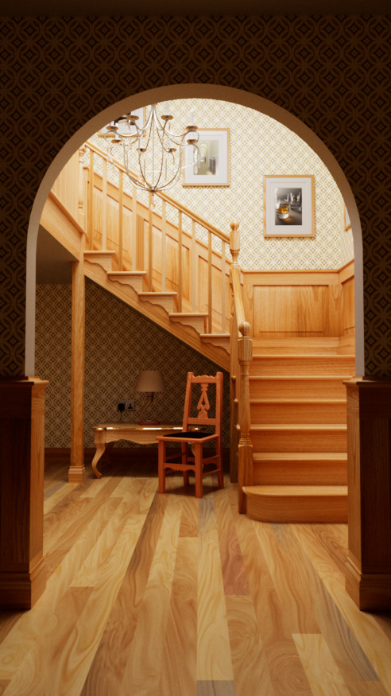
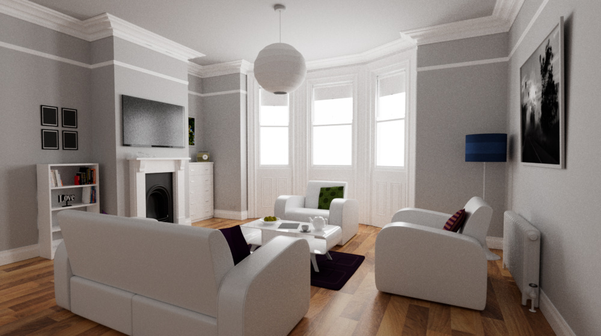

# Caldera Path Tracer

This page has more information about the `trace` app that is part of the [caldera](https://github.com/sjb3d/caldera) project of Vulkan and rust experiments.

The `trace` app is a path tracer that makes use of Vulkan ray tracing extensions.

## Features

* A uni-directional path tracer
  * Implemented as a single Vulkan ray tracing pipeline
  * Support for instanced geometry (via instanced bottom-level acceleration structures)
* Sampling using either:
  * [Progressive Multi-Jittered Sample Sequences](https://graphics.pixar.com/library/ProgressiveMultiJitteredSampling/) implemented in [pmj](https://github.com/sjb3d/pmj)
  * Sobol sequence (as described in [Practical Hash-based Owen Scrambling](http://www.jcgt.org/published/0009/04/01/))
* BSDF importance sampling
  * Diffuse and mirror "ideal" surfaces
  * Fresnel dieletrics and conductors
  * Diffuse with dielectric coating
* Importance sampling of lights
  * Fixed CDF based on light power to select between lights
  * Quad/disc/sphere shaped emitters
  * Dome or solid angle distant lights
* Multiple importance sampling between BSDFs and lights
* Simple fixed material model
  * Reflectance from per-instance constant and/or texture
  * All other parameters are either per-instance or global constants (for now)
* Uses spectral rendering using 3 wavelengths per ray
  * ACES tonemap using the approach in [BakingLab](https://github.com/TheRealMJP/BakingLab/blob/master/BakingLab/ACES.hlsl)
* Interactive renderer with moveable camera and debug UI

## Links

The following crates have been super useful in making the app:

* [ultraviolet](https://crates.io/crates/ultraviolet): maths library with nice API, used for vectors and transforms
* [bytemuck](https://crates.io/crates/bytemuck): safely alias data as bytes, used for copying to GPU buffers
* [imgui](https://crates.io/crates/imgui)/[imgui-winit-support](https://crates.io/crates/imgui-winit-support): rust API for the fantastic [Dear ImGui](https://github.com/ocornut/imgui), for debug UI
* [serde](https://crates.io/crates/serde)/[serde_json](https://crates.io/crates/serde_json): amazing lib to generate serialisation for rust data structures, used to load Tungsten format JSON scenes
* [stb](https://crates.io/crates/stb): rust API for the [stb libraries](https://github.com/nothings/stb), used for image IO and BC compression
* [winit](https://crates.io/crates/winit): cross platform windowing and events

## Gallery

As is tradition, here are some boxes under a couple of different lighting conditions (original [Cornell box](https://www.graphics.cornell.edu/online/box/data.html) data, and a variant with a mirror material and distant lights).

 

Here is a variation on the classic Veach multiple importance sampling scene, showing 64 samples per pixel with BSDF sampling only, light sampling only, then the same samples weighted using multiple importance sampling.

 
 

The next set of images are rendered from these excellent [rendering resources](https://benedikt-bitterli.me/resources/) by Benedikt Bitterli and various artists at [blendswap.com](https://blendswap.com/).

 

There is a barely started exporter for Blender, but support for materials beyond a simple texture map is a bit out of scope for now.  This image uses the "Classroom" [Blender demo file](https://www.blender.org/download/demo-files/), with highly approximated materials and only sunlight:

## Potential Future Work

- [ ] Denoiser?
- [ ] Adaptive sampling
- [ ] HDR display output
- [x] Rough dielectrics
- [ ] Smooth conductors
- [ ] Generic clearcoat?
- [ ] IOR parameters for dielectrics and conductors
- [ ] Interior media
- [x] Sobol sampler
- [ ] Thin lens camera
- [ ] Volumetrics
- [ ] Image-based dome light
- [ ] More flexible materials (graphs?)
- [x] Disc primitive
- [ ] Triangle mesh emitter?
- [ ] Microfacet multi-scattering?
- [ ] Path re-use?
- [x] Spectral rendering?
